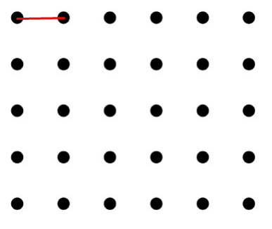
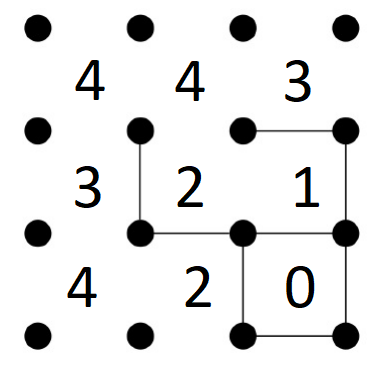

# Projeto Nº1: Época Normal - Fase nº 1 

## Inteligência Artificial 22/23
Prof. Joaquim Filipe

Eng. Filipe Mariano
# Jogo Dots and Boxes

## Manual Técnico

Realizado por:

Miguel Rodrigues - 202001391

João Marques - 202000432

Gabriel Garcia - 202002361

# Indice 

1. Introdução
2. Arquitetura do Sistema
3. Entidades e sua implementação
4. Algoritmos e sua implementação
5. Limitações técnicas
6. Resultados

# Introdução

Neste documento iremos abordar uma versão simplificada do problema "Jogo Dots and Boxes".

A sua implementação com o A*, BFS, DFS e os seus resultados.


# Arquitetura do Sistema


A estrutura do projeto está organizada em 5 ficheiros:

- projeto.lisp - Interação com o utilizador, escrita e leitura de ficheiros.
- puzzle.lisp - Implementação da resolução do problema incluindo seletores, operadores heuristicas e outras funcõess auxiliares.
- procura.lisp - Implementação dos algoritmos de procura BFS, DFS e A*.
- problemas.dat - Tabuleiros representantes do problema.
- solucao.txt - A solução ao problema dado mais os seus dados estatisticos.

# Entidades e sua implementação


  ## Tabuleiro  

O tabuleiro é uma lista de listas, em que a primeira lista são as arestas horizontais por linha e a segunda lista são as arestas verticais por coluna.

```Lisp
    (((0 0 0)(0 0 1)(0 1 1)(0 0 1))((0 0 0)(0 1 0)(0 0 1)(0 1 1)))
```
 ---

## Operadores

Existem 2 tipos de operadores, que podem ter um numero variavel de filhos dependendo do tamanho do tabuleiro.

Os operadores são os seguintes:

```Lisp
(arco-horizontal no posicao indice lista (valor-default 1))
```
```Lisp
(arco-vertical no posicao indice lista (valor-default 1))
```

Os operadores preenchem uma posição aresta do tabuleiro, retornam nil se esta já existir.



Existe uma função operadores que gera todos os operadores possiveis para um dado nó dos 2 tipos:

```Lisp
(defun operadores (cl &optional (pos 1) (i 1))
 (cond
  ((equal pos (+ 1 cl)) nil)
  ((not (equal cl i)) (append (list(list 'arco-vertical pos i '(get-arcos-horizontais ))) (list(list 'arco-horizontal pos i '(get-arcos-verticais ))) (operadores cl pos (+ i 1))) )
  ((equal cl i) (operadores cl (1+ pos) 1))
 )
)

```
## Nó

### Composição do Nó

A composição do nó é uma lista composta por:

(Tabuleiro | Profundidade | Heuristica | Pai)

```Lisp
(defun cria-no (tabuleiro g h pai)
 (list tabuleiro g h pai)
)
```


## Seletores do Nó
Os seletores do Nó são seletores que retornam os atributos que o compõem.

Nomeadamente:

- *no-estado*
- *no-profundidade*
- *no-pai* 
- *no-heuristica* 
- *no-custo* 
- *get-arcos-horizontais*
- *get-arcos-verticais*
- *get-arco-na-posicao*
  

## Sucessões

A Sucessão de um determinado nó, é um conjunto de movimentos permitidos apara colocar uma nova aresta no tabuleiro.


```Lisp
(defun novo-sucessor (pai op)
 (cond
  ((equal nil (funcall (first op) pai (second op) (third op) (funcall (car (fourth op)) pai))) nil)
  (t (cria-no (funcall (first op) pai (second op) (third op) (funcall (car (fourth op)) pai)) (+ 1 (no-profundidade pai)) (heuristica (list (funcall (first op) pai (second op) (third op) (funcall (car (fourth op)) pai))) (get-objective))  pai))
 )
)

(defun sucessores (no opsList)
 (remove nil (mapcar #'(lambda (op) (novo-sucessor no op)) opsList))
)  
```

# Algoritmos e sua implementação

No âmbito deste projeto considera-se que o problema consiste em descobrir o menor numero de jogados que fecham 'x' caixas (x = objetivo).


### Solução 

A solução é uma função de paragem aos algorimos implementados que consistem em verificar se o numero de caixas fechadas de um dado nó é igual ao objetivo.


| Problema      |   Objetivo   |
| ------------- |:-------------:| 
| A  | 3    |  
| B  | 7    |  
| C  | 10   |  
| D  | 10   |   
| E  | 20   | 
| F  | 35  | 


```Lisp
(defun no-objetivop (no objetivo &optional (cl (length (car (no-estado no)))))
 (cond
  ((equal objetivo (nCaixasFechadas no cl)) T)
  (t nil)
 )
)

(defun nCaixasFechadas (no &optional (cl (length (car (no-estado no)))) (iL 1)(posL 1)(iC 1)(posC 1)(caixas 0)(itNumber 1))
 (cond
  ((equal itNumber cl) caixas)
  ((equal cl posC) (nCaixasFechadas no cl 1 (+ posL 1) (+ iC 1) 1 caixas (+ itNumber 1)))
  ((and (equal 1 (get-arco-na-posicao posL iL (get-arcos-horizontais no)))(equal 1 (get-arco-na-posicao (+ 1 posL) iL (get-arcos-horizontais no)))(equal 1 (get-arco-na-posicao posC iC (get-arcos-verticais no)))(equal 1 (get-arco-na-posicao (+ 1 posC) iC (get-arcos-verticais no)))) (nCaixasFechadas no cl (+ iL 1) posL iC (+ posC 1)(+ caixas 1) itNumber))
  ((not(and (equal 1 (get-arco-na-posicao posL iL (get-arcos-horizontais no)))(equal 1 (get-arco-na-posicao (+ 1 posL) iL (get-arcos-horizontais no)))(equal 1 (get-arco-na-posicao posC iC (get-arcos-verticais no)))(equal 1 (get-arco-na-posicao (+ 1 posC) iC (get-arcos-verticais no))))) (nCaixasFechadas no cl (+ iL 1) posL iC (+ posC 1) caixas itNumber))
 )
)
```

Neste projecto, iremos detalhar os algoritmos implementdos abaixo.

## BFS (Breadth First Search)
Na teoria dos grafos, busca em largura é um algoritmo de busca em grafos utilizado para realizar uma busca ou travessia num grafo e estrutura de dados do tipo árvore. Intuitivamente, começa-se pelo vértice raiz e explora todos os vértices vizinhos.


```Lisp
;;; Implementação do BFS
;;; (bfs [operadores: Conjunto de Operadores] [abertos: Lista de abertos inicializada com o no incial] [fechados: Lista de fechados vazia] [pop-no: Atomo que guarda o no retirado da lista de abertos] [it: Atmo de controlo dentro da função recursiva] [bool: Atmo que impede que a função recursiva de devolver nil na primeira iteração]
(defun bfs (objetivo operadores &optional (abertos (list (no-teste))) fechados pop-no (it 1)(bool 0)(starting-time (get-universal-time)))
 (cond
  ((and (not(eq bool 1))(null abertos)) nil)
  ((eq it 1) (bfs objetivo operadores (cdr abertos) (append (list (car abertos))fechados) (car abertos) 2 (+ bool 1) starting-time))
  ((not (eq nil (sucessor-e-objetivo (sucessores pop-no operadores) objetivo))) (list (sucessor-e-objetivo (sucessores pop-no operadores) objetivo)(+(length (sucessores pop-no operadores))(length abertos)(length fechados))(- (length fechados) 1)(/ (length fechados) (+ (length (sucessores pop-no operadores))(length fechados)(length abertos))) (- (get-universal-time) starting-time)))
  ((eq it 2) (bfs objetivo operadores (append abertos (compile-sucessores-fechados (compile-sucessores-abertos (sucessores pop-no operadores) abertos) fechados)) fechados pop-no 1 1 starting-time))  
 )
)
```


## DFS (Depth-first search)
Na teoria dos grafos, busca em profundidade é um algoritmo usado para realizar uma busca ou travessia numa árvore, estrutura de árvore ou grafo. Intuitivamente, o algoritmo começa num nó raiz e explora tanto quanto possível cada um dos seus ramos, antes de retroceder.


```Lisp
;;; Implementação do DLS(Depth Limit Search) = DFS+DEPTH-LIMIT
;;; (dls [operadores: Conjunto de Operadores] [abertos: Lista de abertos inicializada com o no incial] [fechados: Lista de fechados vazia] [pop-no: Atomo que guarda o no retirado da lista de abertos] [it: Atmo de controlo dentro da função recursiva] [bool: Atmo que impede que a função recursiva de devolver nil na primeira iteração]
(defun dls (objetivo depth operadores &optional (abertos (list (no-teste))) fechados pop-no (it 1)(bool 0)(starting-time (get-universal-time)))
 (cond
  ((and (not(eq bool 1))(null abertos)) nil)
  ((eq it 1)(dls objetivo depth operadores (butlast abertos) (append (list (car (last abertos))) fechados) (car (last abertos)) 2 (+ bool 1) starting-time))
  ((and (eq it 2)(< (no-profundidade pop-no) depth))(dls objetivo depth operadores abertos fechados pop-no 3 1 starting-time))
  ((and (eq it 2)(>= (no-profundidade pop-no) depth))(dls objetivo depth operadores abertos fechados pop-no 1 1 starting-time))
  ((and (eq it 3)(sucessor-e-objetivo (sucessores pop-no operadores) objetivo)) (list (sucessor-e-objetivo (sucessores pop-no operadores) objetivo)(+(length (sucessores pop-no operadores))(length abertos)(length fechados))(- (length fechados) 1)(/ (length fechados) (+ (length (sucessores pop-no operadores))(length fechados)(length abertos)))(- (get-universal-time) starting-time) ))
  (t (dls objetivo depth operadores (append (compile-sucessores-fechados (compile-sucessores-abertos (sucessores pop-no operadores) abertos) fechados) abertos) fechados pop-no 1 1 starting-time))
 )
)
```


## A* (A* Search Algorithm)
É um algoritmo de pesquisa que é utilizado para encontrar o caminho mais curto entre um ponto inicial e um ponto final. É um algoritmo útil que é muitas vezes utilizado para a travessia do mapa a fim de encontrar o caminho mais curto.

```LISP
;;; Implementação do A*.
;;; (a* [operadores: Conjunto de Operadores] [abertos: Lista de abertos inicializada com o no incial] [fechados: Lista de fechados vazia] [pop-no: Atomo que guarda o no retirado da lista de abertos] [it: Atmo de controlo dentro da função recursiva] [bool: Atmo que impede que a função recursiva de devolver nil na primeira iteração]
(defun a* (objetivo operadores &optional (abertos (list (no-teste))) fechados pop-no (it 3)(bool 0)(starting-time (get-universal-time)))
 (cond
  ((and (not(eq bool 1))(null abertos)) nil) ;;; SE A LISTA DE ABERTOS FOR NULL ENTÃO NÃO EXSITE NO OBJETIVO
  ((eq it 3) (a* objetivo operadores (abertos-sem-no-menor-custo-a* abertos (pos-no-menor-custo-a* abertos)) fechados (no-menor-custo-a* abertos) 0 (+ bool 1) starting-time)) ;;; RETIRA O NO DE MENOR CUSTO DE ABERTOS, GUARDA REFERENCIA NO "NO-POP"
  ((no-objetivop pop-no objetivo) (list pop-no (+(length (sucessores pop-no operadores))(length abertos)(length fechados)) (length fechados) (/ (length fechados) (+ (length (sucessores pop-no operadores))(length fechados)(length abertos)))(- (get-universal-time) starting-time) )) ;;; SE ALGUM NO SUCESSOR FOR NO OBJETIVO DEVOLVE
  (t (a* objetivo operadores (append abertos (compile-sucessores-fechados-a* (compile-sucessores-abertos-a* (sucessores pop-no operadores) abertos) fechados)) (append (list pop-no) fechados) pop-no 3 1 starting-time)) ;;; SENAO ABERTOS RECEBE NOS SUCESSORES NAO REPETIDOS OU REPETIDOS COM MENOR CUSTO , FECHADOS RECEBE O "NO-POP"
 )
)
```

### No de menor custo
A nossa implementação do algoritmo inves de ordenar-nos e carregar o de menor custo (Primeiro ordenado), procura diretamente na lista o de menor custo sem ordenar:

```LISP
;;; Devolve a posição na lista de abertos do no de menor custo.
;;; (pos-no-menor-custo-a* [abertos: Lista de abertos] [no: Primeiro no da Lista de abertos] [i: Atmo auxiliar] [pos: Atmo devolve a posição do no] )
(defun pos-no-menor-custo-a* (abertos &optional (no (car abertos)) (i 0)(pos 0))
 (cond
  ((null abertos) pos)
  ((< (no-custo (car abertos)) (no-custo no)) (pos-no-menor-custo-a* (cdr abertos) (car abertos) (+ i 1) i))
  (t (pos-no-menor-custo-a* (cdr abertos) no (+ i 1) pos))
 )
)

;;; Devolve o no da lista de abertos de menor custo.
;;; (no-menor-custo-a* [abertos: Lista de abertos] [no: Primeiro no da Lista de abertos] [i: Atmo auxiliar] [pos: Atmo devolve a posição do no] )
(defun no-menor-custo-a* (abertos &optional (no (car abertos)) (i 0)(pos 0))
 (cond
  ((null abertos) no)
  ((< (no-custo (car abertos)) (no-custo no)) (no-menor-custo-a* (cdr abertos) (car abertos) (+ i 1) i))
  (t (no-menor-custo-a* (cdr abertos) no (+ i 1) pos))
 )
)

;;; Devolve a lista de abertos sem o no de menor custo
;;; (pos-no-menor-custo-a* [abertos: Lista de abertos] [pos: Posição do no na lista])
(defun abertos-sem-no-menor-custo-a* (abertos pos)
 (cond
  ((eq 1(length abertos)) (cdr abertos))
  (t (append (subseq abertos 0 pos)(subseq abertos (+ pos 1))))
 )
)
  ```

### Heurística
A heuristica permite aumentar a eficacia/eficiencia do algoritmo A*, uma boa heuristica produz resultados melhor.

---
#### Heuristica Base
A heuristica disponiblizada no enuciado é:

*h(x)=o(x)-m(x)*

*m(x) é o objetivo do dado problema*

*o(x) é o número de pontos de caixas fechadas*

```LISP
(defun nCaixasFechadas (no &optional (cl (length (car (no-estado no)))) (iL 1)(posL 1)(iC 1)(posC 1)(caixas 0)(itNumber 1))
 (cond
  ((equal itNumber cl) caixas)
  ((equal cl posC) (nCaixasFechadas no cl 1 (+ posL 1) (+ iC 1) 1 caixas (+ itNumber 1)))
  ((and (equal 1 (get-arco-na-posicao posL iL (get-arcos-horizontais no)))(equal 1 (get-arco-na-posicao (+ 1 posL) iL (get-arcos-horizontais no)))(equal 1 (get-arco-na-posicao posC iC (get-arcos-verticais no)))(equal 1 (get-arco-na-posicao (+ 1 posC) iC (get-arcos-verticais no)))) (nCaixasFechadas no cl (+ iL 1) posL iC (+ posC 1)(+ caixas 1) itNumber))
  ((not(and (equal 1 (get-arco-na-posicao posL iL (get-arcos-horizontais no)))(equal 1 (get-arco-na-posicao (+ 1 posL) iL (get-arcos-horizontais no)))(equal 1 (get-arco-na-posicao posC iC (get-arcos-verticais no)))(equal 1 (get-arco-na-posicao (+ 1 posC) iC (get-arcos-verticais no))))) (nCaixasFechadas no cl (+ iL 1) posL iC (+ posC 1) caixas itNumber))
 )
)

(defun heuristica (no &optional objective)
 (cond
  ((equal (get-heuristicaop) 1) (- objective (nCaixasFechadas no)))
  ((equal (get-heuristicaop) 2) (bom-vizinho no))
 )
)
```

---
#### Heuristica Desenvolvida

A nossa heuristica analisa o tabuleiro e guarda o numero de ocurrrencias de cada tipo de caixa por fechar (Caixa sem arestas(Ainda não é caixa), 1 aresta, 2 arestas, 3 arestas e 4 arestas(Caixa Fechada))
Um tabuleiro com mais 3 caixas com 3 arestas é melhor que um tabuleiro com 3 caixas com duas areastas; o primeiro está mais perto de fechar as caixas.

```LISP
(defun bom-vizinho (no &optional (cl (length (car (no-estado no)))) (iL 1)(posL 1)(iC 1)(posC 1)(itNumber 1)(c0 0)(c1 0)(c2 0)(c3 0)(c4 0))
 (cond
  ((equal itNumber cl) (+ (* 4 c0)(* 3 c1)(* 2 c2)(* 1 c3)(* 0 c4)))
  ((equal cl posC) (bom-vizinho no cl 1 (+ posL 1) (+ iC 1) 1 (+ itNumber 1) c0 c1 c2 c3 c4))
  ((equal 0 (+ (get-arco-na-posicao posL iL (get-arcos-horizontais no))(get-arco-na-posicao (+ 1 posL) iL (get-arcos-horizontais no))(get-arco-na-posicao posC iC (get-arcos-verticais no))(get-arco-na-posicao (+ 1 posC) iC (get-arcos-verticais no)))) (bom-vizinho no cl (+ iL 1) posL iC (+ posC 1) itNumber (1+ c0) c1 c2 c3 c4))
  ((equal 1 (+ (get-arco-na-posicao posL iL (get-arcos-horizontais no))(get-arco-na-posicao (+ 1 posL) iL (get-arcos-horizontais no))(get-arco-na-posicao posC iC (get-arcos-verticais no))(get-arco-na-posicao (+ 1 posC) iC (get-arcos-verticais no)))) (bom-vizinho no cl (+ iL 1) posL iC (+ posC 1) itNumber c0 (1+ c1) c2 c3 c4))
  ((equal 2 (+ (get-arco-na-posicao posL iL (get-arcos-horizontais no))(get-arco-na-posicao (+ 1 posL) iL (get-arcos-horizontais no))(get-arco-na-posicao posC iC (get-arcos-verticais no))(get-arco-na-posicao (+ 1 posC) iC (get-arcos-verticais no)))) (bom-vizinho no cl (+ iL 1) posL iC (+ posC 1) itNumber c0 c1 (1+ c2) c3 c4))
  ((equal 3 (+ (get-arco-na-posicao posL iL (get-arcos-horizontais no))(get-arco-na-posicao (+ 1 posL) iL (get-arcos-horizontais no))(get-arco-na-posicao posC iC (get-arcos-verticais no))(get-arco-na-posicao (+ 1 posC) iC (get-arcos-verticais no)))) (bom-vizinho no cl (+ iL 1) posL iC (+ posC 1) itNumber c0 c1 c2 (1+ c3) c4))
  ((equal 4 (+ (get-arco-na-posicao posL iL (get-arcos-horizontais no))(get-arco-na-posicao (+ 1 posL) iL (get-arcos-horizontais no))(get-arco-na-posicao posC iC (get-arcos-verticais no))(get-arco-na-posicao (+ 1 posC) iC (get-arcos-verticais no)))) (bom-vizinho no cl (+ iL 1) posL iC (+ posC 1) itNumber c0 c1 c2 c3 (1+ c4)))
 )
)

(defun heuristica (no &optional objective)
 (cond
  ((equal (get-heuristicaop) 1) (- objective (nCaixasFechadas no)))
  ((equal (get-heuristicaop) 2) (bom-vizinho no))
 )
)
```

*h(x)=m(x)*

*m(x) é o $\sum$(Numero de ocorrencias da caixa_i * 4-i)<br>
<p>&nbsp &nbsp &nbsp &nbsp &nbsp &nbsp i=0 -> 4



# Limitações técnicas e ideias para desenvolvimento futuro


Ao longo do desenvolvimento do projeto, tivemos algumas dificuldades em implementar os algoritimos de procura, tendo encontrado alguns problemas com lispworks ao ter a memoria demasiado pequena no espaço da procura, sempre que utiliza-se o algoritmo BFS, DFS e A* com a heuristica base. 

Tivemos tambem algumas dificuldades em resolver bugs do programa pois o debugger de LISP é dificil de utilizar e não conclusivo.
  

# Resultados

Para poder comparar a eficácia dos 4 algoritmos funcionais foi feito uma tabela com as estatisticas de cada algoritmo na resolução de cada problema.

**ABF( Average Branching Factor )* - Fator Médio de Ramificação

## BFS (Breadth First Search)

| Problema         | Nós Gerados   | Nós Expandidos | *g(x)*   Profundidade  |Penetrância|Execução em segundos
| --------- | :-------:|:--------:|:-------:| :---------:| :---------:| 
| A |   152  |  9    |  2    | 10/152      |0 
| B |   16   |  0   |   1   | 1/16       |0 
| C |   Memory Bound   |  Memory Bound    |  Memory Bound    | Memory Bound          |Memory Bound
| D |   Memory Bound   |  Memory Bound    |  Memory Bound    | Memory Bound          |Memory Bound
| E |   Memory Bound   |  Memory Bound    |  Memory Bound    | Memory Bound          |Memory Bound
| F |   Memory Bound   |  Memory Bound    |  Memory Bound    | Memory Bound          |Memory Bound


## DFS (Depth-first search)
*(Usando uma profundidade de 5)*

| Problema         | Nós Gerados   | Nós Expandidos | *g(x)*   Profundidade  |Penetrância|Execução em segundos
| --------- | :-------:|:--------:|:-------:| :---------:| :---------:| 
| A |   77  |  4    |  2    | 5/77      |0 
| B |   16   |  0   |   1   | 1/16        |0 
| C |   Memory Bound   |  Memory Bound    |  Memory Bound    | Memory Bound          |Memory Bound
| D |   Memory Bound   |  Memory Bound    |  Memory Bound    | Memory Bound          |Memory Bound
| E |   Memory Bound   |  Memory Bound    |  Memory Bound    | Memory Bound          |Memory Bound
| F |   Memory Bound   |  Memory Bound    |  Memory Bound    | Memory Bound          |Memory Bound


## A* (A* Search Algorithm)
*(Usando heuristica base)*

| Problema         | Nós Gerados   | Nós Expandidos | *g(x)*   Profundidade  |Penetrância| Execução em segundos
| --------- | :-------:|:--------:|:-------:| :---------:| :---------:| 
| A |   45  |  2    |  2    | 2/45       |0 
| B |   29   |  1   |   1   | 1/29        |0 
| C |   Memory Bound   |  Memory Bound    |  Memory Bound    | Memory Bound          |Memory Bound
| D |   Memory Bound   |  Memory Bound    |  Memory Bound    | Memory Bound          |Memory Bound
| E |   Memory Bound   |  Memory Bound    |  Memory Bound    | Memory Bound          |Memory Bound
| F |   Memory Bound   |  Memory Bound    |  Memory Bound    | Memory Bound          |Memory Bound

## A* (A* Search Algorithm)
*(Usando heuristica criada)*

| Problema         | Nós Gerados   | Nós Expandidos | *g(x)*   Profundidade  |Penetrância|Execução em segundos
| --------- | :-------:|:--------:|:-------:| :---------:| :---------:| 
| A |   100  |  7    |  7    | 7/100      |0 
| B |   75   |  5   |   5   | 1/15       |0 
| C |   143   |  10   |  10    | 10/143          | 0
| D |   Memory Bound   |  Memory Bound    |  Memory Bound    | Memory Bound          |Memory Bound
| E |   756   |  26    |  26    | 26/756          |0
| F |   Memory Bound   |  Memory Bound    |  Memory Bound    | Memory Bound          |Memory Bound
---
---
<br>

# Projeto Nº1: Época Normal 


## Inteligência Artificial 22/23
Prof. Joaquim Filipe

Eng. Filipe Mariano


# Jogo Dots and Boxes


## Manual de Utilizador


Realizado por:

Miguel Rodrigues - 202001391

João Marques - 202000432

Gabriel Garcia - 202002361

# Indice

1. Introdução
2. Instalação
3. Configuração
4. Interface da Aplicação
5. Output


# Introdução

Este documento servirá de manual de utilizador, guiará a instalação de todo o software necessario e de como utiliza-lo.


# Instalação

É necessario instalar um compilador de LISP e o respetivo editor, recomendamos o LispWorks.

Lispworks é uma Integrated cross-platform development tool for Common Lisp  [aqui](http://www.lispworks.com/products/lispworks.html)

A estrutura do projeto está organizada em 5 ficheiros:

- projeto.lisp - Interação com o utilizador, escrita e leitura de ficheiros.
- puzzle.lisp - Implementação da resolução do problema incluindo seletores, operadores heuristicas e outras funcõess auxiliares.
- procura.lisp - Implementação dos algoritmos de procura BFS, DFS e A*.
- problemas.dat - Tabuleiros representantes do problema.
- solucao.txt - A solução ao problema dado mais os seus dados estatisticos.


# Configuração

É necessario alterar a diretoria do projeto nas seguintes funções contidas em projeto.lisp:

```Lisp
(defun get-number-of-lines ()
 (with-open-file (stream "C:/Users/nhenhecas/Documents/GitHub/ProjetoLisp/problem.dat" :direction :input) 
  (get-number-of-lines-aux stream) 
 )
)

(defun my-get-tab (i)
 (with-open-file (stream "C:/Users/nhenhecas/Documents/GitHub/ProjetoLisp/problem.dat" :direction :input) 
  (tab stream i) 
 )
)

(defun write-to-file (params)
 (with-open-file (str "C:/Users/nhenhecas/Documents/GitHub/ProjetoLisp/solucao.txt" :direction :output :if-exists :supersede :if-does-not-exist :create)
  (format str "~a" params))
)
```

Após as funções alteradas deverá abrir os ficheiros puzzle.lisp, projeto.lisp, procura.lisp e compilar cada um deles.


# Interface da Aplicação

## Escolher tabuleiro

No menu princial terá a hipotese de escolher um dos tabuleiros contidos em problema.dat
```
|-------------------------|
|                         |
|   ESCOLHA O TABULEIRO   |
|                         |
|    6 - Tabuleiro 6      |
|    5 - Tabuleiro 5      |
|    4 - Tabuleiro 4      |
|    3 - Tabuleiro 3      |
|    2 - Tabuleiro 2      |
|    1 - Tabuleiro 1      |
|                         |
|-------------------------|
Digite o numero do tabuleiro indicados:
```
## Escolher algoritmo 
Neste menu terá a hipotese de escolher o algotitmo a aplicar a um dos tabuleiros contidos em problema.dat escolhido anteriormente.

```
|-------------------------|
|                         |
|   ESCOLHA O ALGORITMO   |
|                         |
|       1 - BFS           |
|       2 - DLS           |
|       3 - A*            |
|                         |
|       0 - Voltar        |
|                         |
|-------------------------|
Digite o algoritmo do tabuleiro indicados: 
```

### Escolher algoritmo DLS

```
|-------------------------|
|                         |
|   ESCOLHA O ALGORITMO   |
|                         |
|       1 - BFS           |
|       2 - DLS           |
|       3 - A*            |
|                         |
|       0 - Voltar        |
|                         |
|-------------------------|
Digite o algoritmo do tabuleiro indicados: 2

Digite a profundidade:
```
## Escolher heuristica
Neste menu terá a hipotese de escolher a heuristica a aplicar a um dos tabuleiros contidos em problema.dat escolhido anteriormente.
```
|-------------------------|
|                         |
|  ESCOLHA A HEURISTICA   |
|                         |
|       1 - DADA          |
|       2 - GRUPO         |
|                         |
|       0 - Voltar        |
|                         |
|-------------------------|
Digite a heuristica desejada:
```
# Output

## CONSOLE OUTPUT
O output da consela é nil, informa que o algoritmo correu com sucesso até ao nó objetivo. 


## FILE OUTPUT
 O output do ficheiro será uma lista constituida pelo caminhio até ao nó objetivo, profundidade, numero total de nós gerados, numero de nós expandidos, penetração e tempo de execução.

Exemplo problema E executado pelo A* com a heuristica criada. 
```
(((((0 0 0 1 0 0) (1 1 1 1 1 1) (1 1 1 1 1 1) (1 1 1 1 1 1) (1 1 1 1 1 0) (0 0 1 1 1 1) (0 0 1 1 1 1)) ((0 0 0 1 1 1) (1 1 1 1 1 1) (1 1 1 1 1 1) (1 1 1 1 1 1) (1 1 1 1 1 1) (0 1 1 1 0 0) (0 1 1 1 1 1))) 24 23 ((((0 0 0 1 0 0) (1 1 1 1 1 1) (1 1 1 1 1 1) (1 1 1 1 1 1) (1 1 1 1 1 0) (0 0 1 1 1 1) (0 0 1 1 1 1)) ((0 0 0 1 1 1) (1 1 1 1 1 1) (1 1 1 1 1 1) (1 1 1 1 1 1) (1 1 1 1 1 1) (0 0 1 1 0 0) (0 1 1 1 1 1))) 23 25 ((((0 0 0 1 0 0) (1 1 1 1 1 1) (1 1 1 1 1 1) (1 1 1 1 1 1) (1 1 1 1 1 0) (0 0 1 1 1 1) (0 0 1 1 1 1)) ((0 0 0 1 1 1) (1 1 1 1 1 1) (1 1 1 1 1 1) (1 1 1 1 1 1) (1 1 1 1 1 0) (0 0 1 1 0 0) (0 1 1 1 1 1))) 22 27 ((((0 0 0 1 0 0) (1 1 1 1 1 1) (1 1 1 1 1 1) (1 1 1 1 1 1) (1 1 1 1 1 0) (0 0 1 1 1 1) (0 0 1 1 1 1)) ((0 0 0 1 1 1) (1 1 1 1 1 1) (1 1 1 1 1 1) (1 1 1 1 1 1) (1 1 1 0 1 0) (0 0 1 1 0 0) (0 1 1 1 1 1))) 21 29 ((((0 0 0 1 0 0) (1 1 1 1 1 1) (1 1 1 1 1 1) (1 1 1 1 1 1) (1 1 0 1 1 0) (0 0 1 1 1 1) (0 0 1 1 1 1)) ((0 0 0 1 1 1) (1 1 1 1 1 1) (1 1 1 1 1 1) (1 1 1 1 1 1) (1 1 1 0 1 0) (0 0 1 1 0 0) (0 1 1 1 1 1))) 20 31 ((((0 0 0 1 0 0) (1 1 1 1 1 1) (1 1 1 1 1 1) (1 1 1 1 1 1) (1 0 0 1 1 0) (0 0 1 1 1 1) (0 0 1 1 1 1)) ((0 0 0 1 1 1) (1 1 1 1 1 1) (1 1 1 1 1 1) (1 1 1 1 1 1) (1 1 1 0 1 0) (0 0 1 1 0 0) (0 1 1 1 1 1))) 19 33 ((((0 0 0 1 0 0) (1 1 1 1 1 1) (1 1 1 1 1 1) (1 1 1 1 1 1) (1 0 0 1 1 0) (0 0 1 1 1 1) (0 0 1 1 1 1)) ((0 0 0 1 1 1) (1 1 1 1 1 1) (1 1 1 1 1 1) (1 1 1 1 1 1) (1 0 1 0 1 0) (0 0 1 1 0 0) (0 1 1 1 1 1))) 18 35 ((((0 0 0 1 0 0) (1 1 1 1 1 1) (1 1 1 1 1 1) (1 1 1 1 1 1) (0 0 0 1 1 0) (0 0 1 1 1 1) (0 0 1 1 1 1)) ((0 0 0 1 1 1) (1 1 1 1 1 1) (1 1 1 1 1 1) (1 1 1 1 1 1) (1 0 1 0 1 0) (0 0 1 1 0 0) (0 1 1 1 1 1))) 17 37 ((((0 0 0 1 0 0) (1 1 1 1 1 1) (1 1 1 1 1 1) (1 1 1 1 1 0) (0 0 0 1 1 0) (0 0 1 1 1 1) (0 0 1 1 1 1)) ((0 0 0 1 1 1) (1 1 1 1 1 1) (1 1 1 1 1 1) (1 1 1 1 1 1) (1 0 1 0 1 0) (0 0 1 1 0 0) (0 1 1 1 1 1))) 16 39 ((((0 0 0 1 0 0) (1 1 1 1 1 1) (1 1 1 1 1 1) (1 1 1 1 1 0) (0 0 0 1 1 0) (0 0 1 1 1 1) (0 0 1 1 1 1)) ((0 0 0 1 1 1) (1 1 1 1 1 1) (1 1 1 1 1 1) (1 1 1 1 1 0) (1 0 1 0 1 0) (0 0 1 1 0 0) (0 1 1 1 1 1))) 15 41 ((((0 0 0 1 0 0) (1 1 1 1 1 1) (1 1 1 1 1 1) (1 1 1 1 1 0) (0 0 0 1 1 0) (0 0 1 1 1 1) (0 0 1 1 1 1)) ((0 0 0 1 1 1) (1 1 1 1 1 1) (1 1 1 1 1 1) (1 1 1 1 0 0) (1 0 1 0 1 0) (0 0 1 1 0 0) (0 1 1 1 1 1))) 14 43 ((((0 0 0 1 0 0) (1 1 1 1 1 1) (1 1 1 1 1 1) (1 1 0 1 1 0) (0 0 0 1 1 0) (0 0 1 1 1 1) (0 0 1 1 1 1)) ((0 0 0 1 1 1) (1 1 1 1 1 1) (1 1 1 1 1 1) (1 1 1 1 0 0) (1 0 1 0 1 0) (0 0 1 1 0 0) (0 1 1 1 1 1))) 13 45 ((((0 0 0 1 0 0) (1 1 1 1 1 1) (1 1 1 1 1 1) (1 0 0 1 1 0) (0 0 0 1 1 0) (0 0 1 1 1 1) (0 0 1 1 1 1)) ((0 0 0 1 1 1) (1 1 1 1 1 1) (1 1 1 1 1 1) (1 1 1 1 0 0) (1 0 1 0 1 0) (0 0 1 1 0 0) (0 1 1 1 1 1))) 12 47 ((((0 0 0 1 0 0) (1 1 1 1 1 1) (1 1 1 1 1 1) (1 0 0 1 1 0) (0 0 0 1 1 0) (0 0 1 1 1 1) (0 0 1 1 1 1)) ((0 0 0 1 1 1) (1 1 1 1 1 1) (1 1 1 1 1 1) (1 0 1 1 0 0) (1 0 1 0 1 0) (0 0 1 1 0 0) (0 1 1 1 1 1))) 11 49 ((((0 0 0 1 0 0) (1 1 1 1 1 1) (1 1 1 1 1 1) (0 0 0 1 1 0) (0 0 0 1 1 0) (0 0 1 1 1 1) (0 0 1 1 1 1)) ((0 0 0 1 1 1) (1 1 1 1 1 1) (1 1 1 1 1 1) (1 0 1 1 0 0) (1 0 1 0 1 0) (0 0 1 1 0 0) (0 1 1 1 1 1))) 10 51 ((((0 0 0 1 0 0) (1 1 1 1 1 1) (1 1 1 1 1 1) (0 0 0 1 1 0) (0 0 0 1 1 0) (0 0 1 1 1 1) (0 0 1 1 1 1)) ((0 0 0 1 1 1) (1 1 1 1 1 1) (1 1 1 1 1 1) (0 0 1 1 0 0) (1 0 1 0 1 0) (0 0 1 1 0 0) (0 1 1 1 1 1))) 9 53 ((((0 0 0 1 0 0) (1 1 1 1 1 1) (1 1 1 1 1 0) (0 0 0 1 1 0) (0 0 0 1 1 0) (0 0 1 1 1 1) (0 0 1 1 1 1)) ((0 0 0 1 1 1) (1 1 1 1 1 1) (1 1 1 1 1 1) (0 0 1 1 0 0) (1 0 1 0 1 0) (0 0 1 1 0 0) (0 1 1 1 1 1))) 8 55 ((((0 0 0 1 0 0) (1 1 1 1 1 1) (1 1 1 1 1 0) (0 0 0 1 1 0) (0 0 0 1 1 0) (0 0 1 1 1 1) (0 0 1 1 1 1)) ((0 0 0 1 1 1) (1 1 1 1 1 1) (1 1 1 0 1 1) (0 0 1 1 0 0) (1 0 1 0 1 0) (0 0 1 1 0 0) (0 1 1 1 1 1))) 7 57 ((((0 0 0 1 0 0) (1 1 1 1 1 1) (1 1 1 1 1 0) (0 0 0 1 1 0) (0 0 0 1 1 0) (0 0 1 1 1 1) (0 0 1 1 1 1)) ((0 0 0 1 1 1) (1 1 1 1 1 1) (0 1 1 0 1 1) (0 0 1 1 0 0) (1 0 1 0 1 0) (0 0 1 1 0 0) (0 1 1 1 1 1))) 6 59 ((((0 0 0 1 0 0) (1 1 1 1 1 1) (1 1 1 1 1 0) (0 0 0 1 1 0) (0 0 0 1 1 0) (0 0 1 1 1 1) (0 0 1 1 1 1)) ((0 0 0 1 1 1) (1 1 1 0 1 1) (0 1 1 0 1 1) (0 0 1 1 0 0) (1 0 1 0 1 0) (0 0 1 1 0 0) (0 1 1 1 1 1))) 5 61 ((((0 0 0 1 0 0) (1 1 0 1 1 1) (1 1 1 1 1 0) (0 0 0 1 1 0) (0 0 0 1 1 0) (0 0 1 1 1 1) (0 0 1 1 1 1)) ((0 0 0 1 1 1) (1 1 1 0 1 1) (0 1 1 0 1 1) (0 0 1 1 0 0) (1 0 1 0 1 0) (0 0 1 1 0 0) (0 1 1 1 1 1))) 4 63 ((((0 0 0 1 0 0) (1 1 0 1 1 1) (1 1 1 1 1 0) (0 0 0 1 1 0) (0 0 0 1 1 0) (0 0 1 1 1 1) (0 0 1 1 1 1)) ((0 0 0 1 1 1) (1 1 0 0 1 1) (0 1 1 0 1 1) (0 0 1 1 0 0) (1 0 1 0 1 0) (0 0 1 1 0 0) (0 1 1 1 1 1))) 3 65 ((((0 0 0 1 0 0) (1 0 0 1 1 1) (1 1 1 1 1 0) (0 0 0 1 1 0) (0 0 0 1 1 0) (0 0 1 1 1 1) (0 0 1 1 1 1)) ((0 0 0 1 1 1) (1 1 0 0 1 1) (0 1 1 0 1 1) (0 0 1 1 0 0) (1 0 1 0 1 0) (0 0 1 1 0 0) (0 1 1 1 1 1))) 2 67 ((((0 0 0 1 0 0) (0 0 0 1 1 1) (1 1 1 1 1 0) (0 0 0 1 1 0) (0 0 0 1 1 0) (0 0 1 1 1 1) (0 0 1 1 1 1)) ((0 0 0 1 1 1) (1 1 0 0 1 1) (0 1 1 0 1 1) (0 0 1 1 0 0) (1 0 1 0 1 0) (0 0 1 1 0 0) (0 1 1 1 1 1))) 1 69 ((((0 0 0 1 0 0) (0 0 0 1 1 1) (1 1 1 1 1 0) (0 0 0 1 1 0) (0 0 0 1 1 0) (0 0 1 1 1 1) (0 0 1 1 1 1)) ((0 0 0 1 1 1) (0 1 0 0 1 1) (0 1 1 0 1 1) (0 0 1 1 0 0) (1 0 1 0 1 0) (0 0 1 1 0 0) (0 1 1 1 1 1))) 0 71 NIL))))))))))))))))))))))))) 690 24 24/691 0)
```